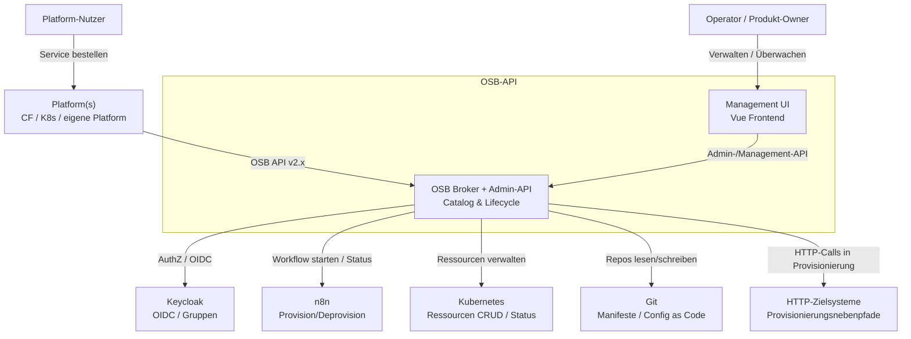
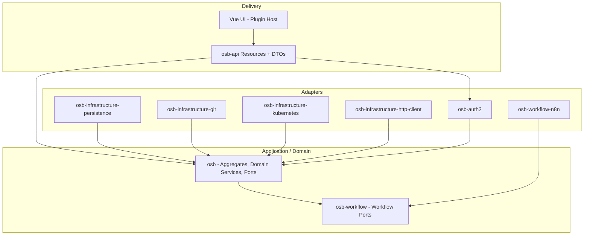
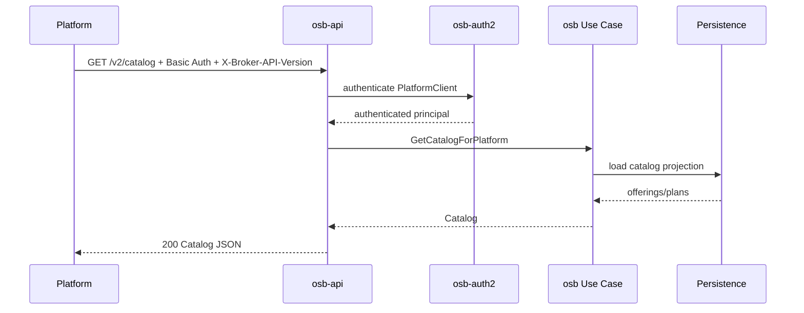
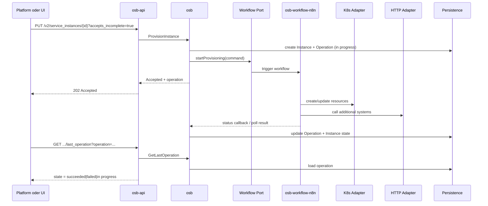
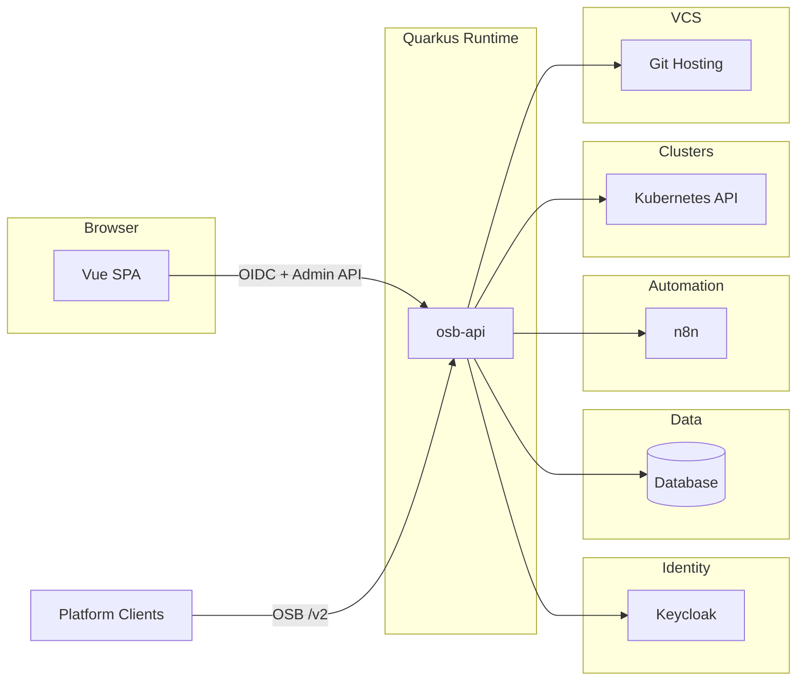

# arc42 Architektur­dokumentation — OSB-API

| Attribut | Wert |
| --- | --- |
| Projekt | OSB-API |
| Status | Zielbild / Entwurf (noch nicht vollständig) |
| Version | 0.1.0 |
| Datum | 2026-07-18 |
| Backend | Java / Quarkus |
| Frontend | Vue.js |
| Referenz­spezifikation | [Open Service Broker API v2.17](https://github.com/openservicebrokerapi/servicebroker/blob/v2.17/spec.md) |

---

## 1. Einführung und Ziele

### 1.1 Aufgabenstellung

OSB-API ist ein **Open-Service-Broker** inkl. Management-UI. Das System:

- stellt die OSB-API gegenüber einer oder mehreren **Platformen** bereit (Catalog, Provision, Update, Deprovision, Binding/Unbinding, Last Operation),
- ermöglicht die **Pflege** von Katalogen, Service Offerings (Produkte) und Service Plans,
- **überwacht** den Status von Service Instances,
- unterstützt **Provisionierung und Deprovisionierung** auch ohne Platform-Client (Operator-getrieben über UI/API),
- verwaltet **Zuordnungen** von Service Instances zu Platform-Clients,
- orchestriert die technische Umsetzung über austauschbare Workflow- und Infrastruktur-Adapter (n8n, Kubernetes, Git, HTTP).

### 1.2 Qualitätsziele

| Prio | Qualitätsziel | Szenario / Messgröße |
| --- | --- | --- |
| 1 | **OSB-Konformität** | Platform-Clients können Catalog/Lifecycle gemäß OSB API v2.17 nutzen (`X-Broker-API-Version`, Basic Auth der Platform, async mit `accepts_incomplete` / `last_operation`). |
| 2 | **Modularität / Austauschbarkeit** | Infrastruktur (Persistence, Git, K8s, HTTP, Workflow-Engine, Auth) ist hinter Ports austauschbar; Domain bleibt frei von Framework-Details. |
| 3 | **Nachvollziehbarkeit** | Provision/Deprovision-Läufe sind pro Instance und Operation auditierbar (wer, was, wann, Ergebnis, korrelierende `operation`-Id). |
| 4 | **Erweiterbarkeit** | Neue Workflow-Implementierungen, HTTP-Netze und UI-Plugins können ergänzt werden, ohne Core-Module umzubauen. |
| 5 | **Betriebsfähigkeit** | Health, strukturierte Logs, klare Fehlermapping auf OSB Error Codes (`AsyncRequired`, `ConcurrencyError`, …). |

### 1.3 Stakeholder

| Rolle | Erwartung |
| --- | --- |
| Platform-Betreiber (CF, K8s/Service Catalog, eigene Platform) | Stabile, spezifikations­konforme Broker-API |
| Service-/Produkt-Owner | Katalog, Produkte, Pläne pflegen; Instanzen steuern |
| Operator / SRE | Status überwachen, manuell provisionieren/deprovisionieren, Troubleshooting |
| Entwickler:innen | Klare Modulgrenzen, Clean Architecture, testbare Domain |
| Security / IAM | Platform-Auth (OSB) + OIDC/Keycloak für UI und Admin-API; Gruppenberechtigungen |
| Architektur | Documented decisions, evolutionäres Zielbild |

---

## 2. Randbedingungen

### 2.1 Technische Randbedingungen

| ID | Randbedingung |
| --- | --- |
| TC-1 | Backend: **Java + Quarkus** (Maven Multi-Modul) |
| TC-2 | Frontend: **Vue.js**, Atomic Design, MVC, Plugin-Architektur |
| TC-3 | Architektur Backend: **Clean Architecture**, **SOLID**, modular |
| TC-4 | Domain: **DDD** (kein anämisches Modell), Ports als Interfaces im Modul `osb` |
| TC-5 | API-DTOs als **Java Records** |
| TC-6 | Authentifizierung Platform-Clients gemäß OSB Spec; perspektivisch **OIDC** über Keycloak |
| TC-7 | Workflow-Orchestrierung zunächst über **n8n** (`osb-workflow-n8n`) |
| TC-8 | Infrastruktur-Clients für **Git**, **Kubernetes**, **HTTP** und Persistence |

### 2.2 Organisatorische Randbedingungen

| ID | Randbedingung |
| --- | --- |
| OC-1 | Zielbild ist bewusst unvollständig; Dokumentation und Module wachsen iterativ |
| OC-2 | Spezifikations­treue vor Feature-Vollständigkeit bei der öffentlichen OSB-Fläche |

### 2.3 Konventionen

| Thema | Konvention |
| --- | --- |
| Modulnamen | `osb`, `osb-api`, `osb-workflow`, `osb-workflow-n8n`, `osb-auth2`, `osb-infrastructure-*` |
| Dependency-Regel | Abhängigkeiten zeigen **nach innen** (API/Infra → Domain-Interfaces); Domain kennt keine Infra |
| API-Schicht | Resources + Record-DTOs; Mapping an der Grenze |
| Frontend | Atomic Design (Atoms → Organisms → Templates → Pages); Features als Plugins |

---

## 3. Kontextabgrenzung

### 3.1 Fachlicher Kontext



### 3.2 Technischer Kontext

| Nachbarsystem | Protokoll / Schnittstelle | Richtung | Zweck |
| --- | --- | --- | --- |
| Platform-Client | HTTPS, OSB REST (`/v2/...`), Basic Auth (OSB Spec) | inbound | Catalog, Instance/Binding Lifecycle |
| Management UI | HTTPS, REST/JSON (eigene Admin-API), OIDC | inbound | Pflege & Monitoring |
| Keycloak | OIDC / Token Introspection / Roles | outbound | UI- und Admin-AuthZ |
| n8n | HTTPS (Webhook/API) | outbound | Workflow-Ausführung |
| Kubernetes API | HTTPS + ServiceAccount/Token | outbound | Create/Update/Delete/Get Resources |
| Git | HTTPS/SSH (Git-Client) | outbound | Config/Manifest Management |
| HTTP-Netze | HTTPS (konfigurierbare Clients) | outbound | Provisionierungs­nebenpfade |
| Persistenz | JDBC / DB (konkret TBD) | outbound | Domain Persistence |

### 3.3 OSB-API-Oberfläche (Kern)

Gemäß [OSB API v2.17](https://github.com/openservicebrokerapi/servicebroker/blob/v2.17/spec.md):

| Endpoint (Auszug) | Bedeutung |
| --- | --- |
| `GET /v2/catalog` | Service Offerings + Plans |
| `PUT/PATCH/DELETE /v2/service_instances/{instance_id}` | Provision / Update / Deprovision |
| `GET .../last_operation` | Async-Status Instance |
| `PUT/DELETE .../service_bindings/{binding_id}` | Bind / Unbind |
| `GET .../service_bindings/.../last_operation` | Async-Status Binding |
| Header `X-Broker-API-Version` | Pflicht für Platform-Calls |

Zusätzlich (eigene Erweiterung, nicht Teil der OSB Spec):

- Admin-API für Katalog-/Produkt-/Plan-Pflege
- Operator-Provisionierung ohne Platform
- Zuordnung Instance ↔ Platform-Client
- Monitoring- und Audit-Endpunkte

---

## 4. Lösungsstrategie

1. **Domain-first (`osb`)**  
   Reiches DDD-Modell (Catalog, ServiceOffering, Plan, ServiceInstance, Binding, PlatformClient, Operation) mit Invarianten und Domain Services. Ports (Interfaces) liegen im Domain-Modul.

2. **Use-Case-getriebene Application Layer**  
   Application Services im Domain-Umfeld orchestrieren Ports (Persistence, Workflow, K8s, Git, HTTP, Auth). Keine Framework-Annotationen in der Domain.

3. **Adapter-Module**  
   Jede Infrastruktur-Technologie hat ein eigenes Modul und implementiert ausschließlich Domain-/Workflow-Ports.

4. **Workflow als Port**  
   `osb-workflow` definiert nur Interfaces (z. B. `ProvisioningWorkflow`, `DeprovisioningWorkflow`, Status-Callbacks). `osb-workflow-n8n` ist die erste Implementierung.

5. **API als dünne Schicht (`osb-api`)**  
   Quarkus Resources mappe OSB/Admin-DTO-Records ↔ Domain. Keine Business-Logik in Resources.

6. **Auth getrennt (`osb-auth2`)**  
   Platform-Basic-Auth gemäß OSB Spec + Keycloak/OIDC für UI/Admin inkl. Gruppenrechte (Catalog/Product/Plan/Service bearbeiten).

7. **Frontend als Plugin-Host**  
   Vue + Atomic Design + MVC; Domänen-Features als Plugins (z. B. Catalog-Plugin, Instance-Plugin, Workflow-Command-Plugin).

8. **Async-first für Lifecycle**  
   Provision/Deprovision typischerweise asynchron (`202` + `operation` + Polling), passend zu Workflow-Engines und K8s-Reconciliation.

---

## 5. Bausteinsicht

### 5.1 Modulübersicht (Backend)

```text
osb-api/                          (Aggregator)
├── osb                           Domain + Ports (DDD)
├── osb-workflow                  Workflow-Ports (nur Interfaces)
├── osb-workflow-n8n              Adapter: n8n
├── osb-auth2                     AuthN/AuthZ (OSB Platform + Keycloak/OIDC)
├── osb-infrastructure-persistence
├── osb-infrastructure-git
├── osb-infrastructure-kubernetes
├── osb-infrastructure-http-client
├── osb-api                       OSB + Admin API (:8080)
├── osb-bff                       Frontend-BFF (:8081, Quinoa + OIDC + Proxy)
├── osb-devservices               Docker/Podman Compose (DB, Keycloak, n8n, Gitea) + Kind scripts
└── frontend                      Vue Admin UI (Atomic Design, MVC, i18n)
```



> Abhängigkeitstechnisch implementieren Adapter die Interfaces aus `osb` / `osb-workflow`. Zur Compile-Zeit hängen Adapter von den Interface-Modulen ab; zur Laufzeit verdrahtet Quarkus CDI die Implementierungen.

### 5.2 Modulverantwortung

| Modul | Verantwortung | Enthält | Enthält nicht |
| --- | --- | --- | --- |
| **osb** | Fachliches Modell, Invarianten, Ports | Aggregates, Value Objects, Domain Events, Repository-/Client-Interfaces, Application Use Cases (optional als Subpaket) | Quarkus/REST, JPA-Entities, n8n/K8s-SDKs |
| **osb-workflow** | Abstraktion Provision/Deprovision-Orchestrierung | Interfaces, Command/Status-Typen | konkrete Engine |
| **osb-api** | HTTP-Grenze OSB + Admin | Resources, Record-DTOs, Mapper, Exception → OSB Error Mapping | Business-Regeln |
| **osb-infrastructure-persistence** | Persistenz-Adapter | Repository-Impl, DB-Schema/Migrationen | Domain-Logik |
| **osb-infrastructure-git** | Git-Client | Clone/Commit/Push/Pull, später UI-Commands | Domain-Invarianten |
| **osb-infrastructure-kubernetes** | K8s-Client | CRUD/Watch/Status von Resources; später UI-Commands | Workflow-Orchestrierung |
| **osb-infrastructure-http-client** | Konfigurierbare HTTP-Netze | Client-Pools, Auth-Profiles, Targets für Provisionierung | Katalog-Regeln |
| **osb-workflow-n8n** | n8n-Anbindung | Start Workflow, Status/Callback, Mapping auf Workflow-Port | UI |
| **osb-auth2** | Authentifizierung & Rechte | Platform-Credentials, OIDC/Keycloak, Gruppen→Permissions | Provisionierungs­logik |

### 5.3 Domain-Bausteine (Skizze, kein anämisches Modell)

| Aggregate / Entity | Verantwortung (Beispiele) |
| --- | --- |
| `Catalog` | Offerings verwalten, Sichtbarkeit gegenüber Platformen |
| `ServiceOffering` (Produkt) | bindable-Defaults, Pläne, Metadaten, Aktivierung |
| `ServicePlan` | Schemas, free/bindable-Overrides, async-Anforderungen |
| `ServiceInstance` | Lifecycle-Zustände, Parameter, MaintenanceInfo, Zuordnung PlatformClient |
| `ServiceBinding` | Credentials/Lifecycle, Rotation (falls unterstützt) |
| `PlatformClient` | Identität der Platform, Credentials, erlaubte Catalog-Scopes |
| `Operation` | Async-Operation-Id, Status (`in progress` / `succeeded` / `failed`), Korrelation zum Workflow |

Verhalten liegt an den Aggregates/Domain Services (z. B. `instance.requestProvision(...)`, `instance.completeOperation(...)`), nicht in „dummen“ Getter/Setter-DTOs.

### 5.4 Frontend-Bausteine

```text
apps/web/ (Arbeitstitel)
├── core/                 Plugin-Host, Router, Auth, Shell
├── design-system/        Atoms, Molecules (Atomic Design)
├── plugins/
│   ├── catalog/
│   ├── products-plans/
│   ├── instances/
│   ├── platforms/
│   └── workflow-commands/  (Git/K8s/HTTP Commands später)
└── shared/               MVC: Models, Controllers/Stores, Views
```

| Schicht | Rolle |
| --- | --- |
| Model | API-Client-Typen, View-State |
| View | Atomic Components / Pages |
| Controller | Stores/Composables orchestrieren Use Cases |
| Plugin | Registriert Routes, Navigation, Capabilities |

---

## 6. Laufzeitsicht

### 6.1 Catalog abrufen (Platform)



### 6.2 Asynchrone Provisionierung



### 6.3 Operator-Provisionierung ohne Platform-Client

1. Operator authentifiziert sich via OIDC (Keycloak) in der UI.  
2. UI ruft Admin-API `POST /admin/service_instances` (Name TBD).  
3. Derselbe Domain-Use-Case `ProvisionInstance` wie bei OSB, inkl. optionaler Zuordnung zu einem PlatformClient.  
4. Status erscheint in UI-Monitoring und über `last_operation`-Äquivalent der Admin-API.

### 6.4 Deprovisionierung

Spiegelbildlich zu 6.2 über `DeprovisioningWorkflow`; bei Erfolg Instance/Bindings gemäß OSB-Regeln entfernen bzw. `410 Gone` bei async delete polling.

---

## 7. Verteilungssicht



Konkrete Deployment-Topologie (Single Pod vs. getrennte Worker, DB-Produkt, Ingress) ist **TBD**.

---

## 8. Querschnittliche Konzepte

### 8.1 Clean Architecture / Dependency Rule

- Entities/Domain Services: stabil, frameworkfrei  
- Ports: Interfaces in `osb` / `osb-workflow`  
- Adapters: Infra-Module + `osb-api` + `osb-auth2`  
- Composition Root: Quarkus CDI in `osb-api`

### 8.2 Authentifizierung & Autorisierung

| Fläche | Mechanismus | Modul |
| --- | --- | --- |
| OSB Platform API | Basic Auth (Username/Password pro Platform-Client) gemäß Spec; später erweiterbar | `osb-auth2` |
| Admin-API / UI | OIDC (Keycloak), Gruppen → Permissions | `osb-auth2` |

Beispielhafte Permissions (Ziel):

- `catalog:read|write`
- `offering:read|write`
- `plan:read|write`
- `instance:read|provision|deprovision|assign`
- `platform-client:read|write`
- `workflow-command:read|write|execute` (später)

### 8.3 Mapping OSB ↔ Domain

- OSB JSON (Records in `osb-api`) ≠ Domain-Model  
- Mapper nur an der API-Grenze  
- OSB Error Codes zentral mappen (z. B. Domain `AsyncRequired` → HTTP 422 + `"error": "AsyncRequired"`)

### 8.4 Workflow & Commands

- Workflow-Port beschreibt **Was** (Provision Instance X mit Plan Y).  
- Adapter (n8n) beschreibt **Wie**.  
- Später: UI hinterlegt ausführbare Commands für Git/K8s/HTTP (Command-Palette / Policy-geprüft).

### 8.5 Multi-Platform

- Mehrere `PlatformClient`-Aggregate  
- Catalog kann gefiltert/gescopet pro Platform erfolgen (Produktentscheidung TBD)  
- Instance speichert Herkunft (`platformClientId`, Originating Identity falls vorhanden)

### 8.6 Observability

- Correlation: `X-Broker-API-Request-Identity` (OSB) + interne Trace-Id  
- strukturierte Logs pro Operation  
- Metriken: provision duration, failure rate, polling counts (TBD)

### 8.7 Frontend-Konzepte

- Atomic Design für UI-Konsistenz  
- MVC innerhalb der Plugins  
- Plugin-Registry im Core (routes, menu, permissions, widgets)

---

## 9. Entwurfsentscheidungen (ADR-Skizzen)

### ADR-001 — Modulzuschnitt nach Ports & Adapters

- **Status:** vorgeschlagen  
- **Kontext:** Verschiedene Infra-Technologien und austauschbare Workflow-Engines  
- **Entscheidung:** Maven-Module je Bounded Context / Adapter  
- **Konsequenz:** mehr Module, dafür klare Grenzen und unabhängige Evolution

### ADR-002 — Reiches Domain-Modell in `osb`

- **Status:** vorgeschlagen  
- **Kontext:** Vermeidung anämischer Modelle  
- **Entscheidung:** Aggregates mit Verhalten; Persistenz-Adapter mappen auf eigene Persistenzmodelle  
- **Konsequenz:** Mapping-Aufwand, dafür testbare Invarianten

### ADR-003 — Workflow hinter Interface, erste Impl. n8n

- **Status:** vorgeschlagen  
- **Entscheidung:** `osb-workflow` + `osb-workflow-n8n`  
- **Konsequenz:** Engine austauschbar (Temporal/Camunda später denkbar)

### ADR-004 — Auth in eigenem Modul `osb-auth2`

- **Status:** vorgeschlagen  
- **Entscheidung:** OSB-Platform-Auth und OIDC/Gruppenrechte zentral in einem Auth-Modul  
- **Konsequenz:** API bleibt schlank; Security-Policies an einer Stelle

### ADR-005 — Async-default für Provision/Deprovision

- **Status:** vorgeschlagen  
- **Entscheidung:** Primär `202` + `last_operation`, weil Workflows/K8s selten synchron fertig sind  
- **Konsequenz:** Platform muss `accepts_incomplete=true` senden; sonst `AsyncRequired`

### ADR-006 — Frontend Plugin-Architektur

- **Status:** vorgeschlagen  
- **Entscheidung:** Core-Shell + Feature-Plugins  
- **Konsequenz:** Features entkoppelbar; Command-UI später als Plugin

---

## 10. Qualitätsanforderungen

| ID | Anforderung | Ansatz |
| --- | --- | --- |
| Q-01 | OSB Spec Conformance Tests (mindestens Catalog + Provision/Deprovision + Last Operation) | Contract Tests gegen Spec/OpenAPI |
| Q-02 | Domain-Invarianten unit-testbar ohne Quarkus | reine JVM-Tests auf `osb` |
| Q-03 | Adapter-Tests mit Testcontainers wo sinnvoll | DB, ggf. WireMock für n8n/HTTP |
| Q-04 | AuthZ: negativ-Tests für fehlende Gruppenrechte | `osb-auth2` + API-Tests |
| Q-05 | Nachvollziehbare Operation-Historie | Persistenz + UI |
| Q-06 | Ausfall n8n/K8s führt zu sauberem `failed` + Beschreibung | Timeout/Retry-Policy TBD |

### 10.1 Qualitätsszenarien

1. **Platform provisioniert async:** Innerhalb von X Sekunden `202`, danach Polling bis `succeeded`.  
2. **Operator ohne Platform:** Instance über UI anlegen, gleicher Domain-Pfad.  
3. **Rechte:** User ohne `plan:write` kann Pläne nicht ändern (403).  
4. **Modulersatz:** n8n-Adapter durch Stub ersetzen → Domain-Tests grün.

---

## 11. Risiken und technische Schulden

| ID | Risiko | Impact | Gegenmaßnahme |
| --- | --- | --- | --- |
| R-01 | Zielbild unvollständig → Scope Creep | hoch | arc42 + ADRs iterativ pflegen; MVP schneiden |
| R-02 | OSB-Konformitätslücken (Headers, Error Codes, Idempotenz) | hoch | Spec-Checkliste + Conformance Tests früh |
| R-03 | Leakage von Infra in Domain | mittel | ArchUnit-Regeln für Dependency Rule |
| R-04 | n8n als SPOF / schwieriges Statusmodell | mittel | klare Operation-State-Machine; Callback + Poll; Timeout |
| R-05 | Command-UI für Git/K8s (Sicherheit) | hoch | Policy, Allowlist, Audit, least privilege |
| R-06 | Multi-Platform Catalog-Scoping unklar | mittel | Produktentscheidung vor Implementierung |
| R-07 | „osb-auth2“-Name vs. OAuth2/OIDC-Scope | niedrig | Naming in ADR klären (`osb-security`?) |
| R-08 | Frontend-Plugin-Contract fehlt | mittel | frühes Plugin-Manifest (routes, permissions, slots) |

---

## 12. Glossar

| Begriff | Bedeutung |
| --- | --- |
| **OSB / OSBAPI** | Open Service Broker API — Standard für Catalog & Service Lifecycle zwischen Platform und Broker |
| **Platform** | Client des Brokers (z. B. Cloud Foundry, Kubernetes Service Catalog, eigene Platform) |
| **Service Broker** | Diese Anwendung in der Rolle gegenüber der Platform |
| **Catalog** | Menge der angebotenen Service Offerings |
| **Service Offering / Produkt** | Anbietbarer Service im Catalog |
| **Service Plan** | Variante/Stufe eines Offerings |
| **Service Instance** | Bereitgestellte Instanz eines Plans |
| **Service Binding** | Zugang/Credentials einer Instance für eine App/Workload |
| **Last Operation** | Polling-Endpunkt für asynchrone Operationen |
| **Platform-Client** | Registrierte Platform-Identität inkl. Credentials und Zuordnungen |
| **Workflow Port** | Interface zur Orchestrierung von Provision/Deprovision |
| **n8n** | Workflow-Automation-Engine (erste Adapter-Implementierung) |
| **Clean Architecture** | Abhängigkeit nur nach innen zu Domain/Ports |
| **DDD** | Domain-Driven Design; reiches Modell mit Verhalten |
| **Atomic Design** | UI-Zerlegung Atoms → Molecules → Organisms → Templates → Pages |

---

## Anhang A — Vorgeschlagene Maven-Koordinaten (Arbeitstitel)

```text
com.example.osb:osb
com.example.osb:osb-workflow
com.example.osb:osb-workflow-n8n
com.example.osb:osb-api
com.example.osb:osb-auth2
com.example.osb:osb-infrastructure-persistence
com.example.osb:osb-infrastructure-git
com.example.osb:osb-infrastructure-kubernetes
com.example.osb:osb-infrastructure-http-client
```

GroupId/Package-Namespace sind **TBD**.

## Anhang B — Offene Punkte (Backlog Architektur)

- [ ] Konkrete OSB-Version als verbindliche Baseline (Empfehlung: 2.17)  
- [ ] DB-Produkt und Migrations-Tool (Flyway/Liquibase)  
- [ ] Ob Application Layer in `osb` oder eigenes Modul `osb-application`  
- [ ] Binding-Support im MVP: ja/nein  
- [ ] Catalog-Scoping pro Platform  
- [ ] Callback- vs. Poll-Modell für n8n  
- [ ] Secret-Handling (Credentials in Bindings, Platform-Passwörter)  
- [ ] Package-/Repo-Struktur Frontend Monorepo vs. getrennt  
- [ ] CI-Gates: ArchUnit, Spec-Contract-Tests  

## Anhang C — Dokumenthistorie

| Version | Datum | Änderung |
| --- | --- | --- |
| 0.1.0 | 2026-07-18 | Erstes Zielbild als arc42 aus Projektbriefing |
